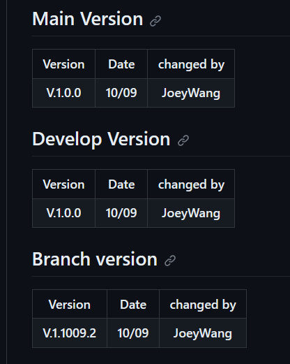
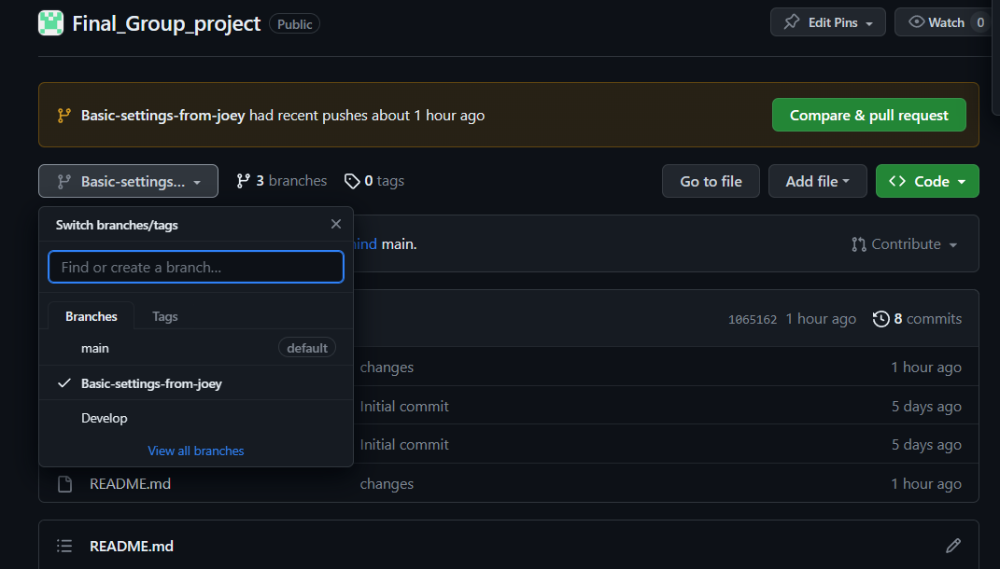
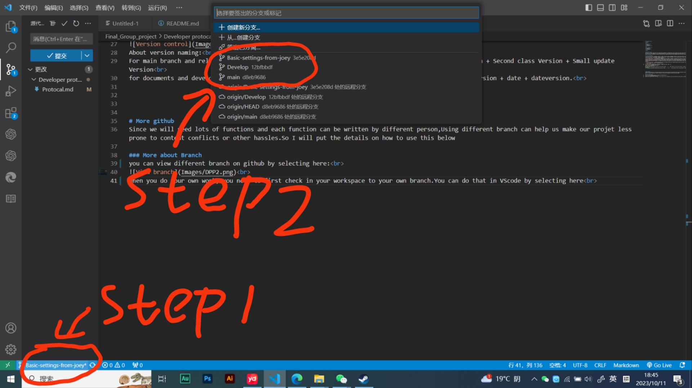

# Develop Protocal
# Version
<table>
<tr>
<th>Version</th>
<th>Date</th>
<th>changed by</th>
</tr>
<tr>
<th>V.1.1024.4</th>
<th>10/24</th>
<th>JoeyWang</th>
</tr>
</table>

# Why we got this
Git hub is a really useful tool but could also be dangerous. We might waste lots of time if we can't use the github properly.What we have learnt in the class is not enough for us to github efficient. So I will put more useful details about github here <br>
Besides that,Some protocals can make our team work more high-efficiency and less mistake.So we can put all these things in this document.<br>
github虽然很好用但是不规范的使用也可能导致一些麻烦。我们上课所学的东西是并不足以支撑我们利用github高效开发的。因此我会在这个文档里放更多关于github的细节和一些可以让我们的开发更加高效和安全的细节在这里<br>
# Version management
We will put our version management table in readme file,The version management table will show the version of three branch<br>
```The main Branch``` is the most inpoetant branch,we won't commit any changes to this branch unless we have some realy meaningfuf progress and 100% sure that there are no bugs in touse progress<br>

```The release branch``` will storage our combined work,For example: teammate A finfshed color function on his branch,Team mateB finished circle generate functions on her branch,Then both of them commit their branch to the release Branch.Once all the member commit their changes to the release branch and finished debug, we can drag the latest release branch to do the next step develop.we will only update the release branch when everyone agree,and once we have a new release version,every one should first drag the release branch to their own develop branch then do the later works<br>

```The develop branch``` is where everyone do thir own develop work you can commit an many times as you want. the only thing you should be careful is do not change other people's develop branch<br>


```naming rules```
All the version management will be puted in readme file like  this :<br>
<br>
About version naming:<br>
For main branch and release branch,we can use this format```x.x.x```This stand for First class version + Second class Version + Small update Version<br>
for documents and develop branch,We can use this format:```x..xxxx.x``` This stand for First class version + date + dateversion.<br> 

在readme文档里会有关于三条不同重要分支的版本管理的信息<br>
```The main Branch``` 是最重要的一条主分支，基本上在任何时候都不要在这条分支上做任何改动除非我们真的确定没有任何bug且取得了一些阶段性的进展<br>
```The release branch```里面会存放我们不同功能的合并版本，比如说A完成了一个功能，B完成了另一个功能，这两个功能需要合并起来，那我们就会把这个两个人的版本都合并到release Branch上面去，然后在下一个开发阶段所有人先去release branch上面把当前最新版本拉取到自己的分支上，然后再进行后续更改<br>
```The develop branch``` 是每个人做自己部分功能时会用到的一个分支，只要确保自己没有改到别人的分支上去就好了<br>
所有的版本管理信息都会如上图所示<br>
在主分支和release分支里版本命名模式是```x.x.x```，三个版本号分别表示大版本，二级版本和小升级版本<br>
再个人的dev分支里命名模式是```x..xxxx.x```，三个版本号分别是大版本号，日期号和当日升级次数<br>


# More github
Since we will need lots of functions and each function can be written by different person,Using different branch can help us make our projet less prone to content conflicts or other hassles.So I will put the details on how to use this below
由于我们需要写很多个不同的功能函数，而每个函数可能是不同的人在写，因此使用不同的分支可以减少项目内容冲突或其他麻烦。<br>

### View different Branch
you can view different branch on github by selecting here:<br>
通过如下操作以查看不同的分支<br>
<br>
### Switch workplace
When you do your own work, you need to first change your workspace to your own branch.You can do that in VScode by selecting here<br>
在开始写自己的部分之前，一定要先通过以下方式把分支切换到自己的那条分支上去<br>
<br>
or you can also use comand:Git: check out,then selest your own branch
### Merge branch
you can combine two different branch together by using merge command.To merge Two different branch. You need to first check out to the branch that you want to change.then use merge command to select the branch you want to combined with.(for example: you want have made some changes on development branch,and you want put those change to release branch,then you need to first check out to release branch, then use merge branch command,and select develop branch.)<br>
使用merge命令可以将两个不同的分支合并在一起。您需要先签出到您要更改的分支，然后使用合并命令选择您要合并的分支（例如：您想在开发分支上做一些更改，并想把这些更改放到发布分支上，那么您需要先签出到发布分支，然后使用合并分支命令，并选择开发分支）。<br>

